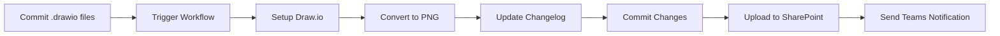

# Diagrams V3 Project Summary

## 🎯 Project Overview

**Diagrams V3** is a complete redesign of the Draw.io processing workflow, built from scratch with a focus on **simplicity, reliability, and maintainability**. 

### What It Does
1. **Converts Draw.io files to PNG** automatically on commit
2. **Maintains a changelog** of all processing activities  
3. **Uploads changelog to SharePoint** using Microsoft Graph API
4. **Sends Teams notifications** about processing results

## 🏗️ Architecture

### Ultra-Simplified Design
- **Single workflow file** (`.github/workflows/diagrams.yml`)
- **Two clean jobs**: `process` → `notify`
- **No external scripts** - everything in YAML
- **Minimal configuration** - uses repository variables

### Core Workflow


## 📂 Project Structure

```
diagrams-v3/
├── .github/workflows/
│   └── diagrams.yml           # Single workflow file
├── drawio_files/
│   └── sample-diagram.drawio  # Your Draw.io files
├── png_files/                 # Auto-generated
│   ├── CHANGELOG.csv          # Processing log
│   └── *.png                  # Converted images
├── .gitignore                 # Standard ignore file
├── README.md                  # Main documentation
├── SETUP.md                   # Configuration guide
├── MIGRATION.md               # V2 → V3 migration guide
└── PROJECT_SUMMARY.md         # This file
```

## 🔄 Key Simplifications from V2

### Removed Complexity
- ❌ **No shell scripts** - everything in workflow YAML
- ❌ **No ID assignment** - files keep original names
- ❌ **No version tracking files** (.counter, .versions)
- ❌ **No complex versioning** - simple 1.0 for all
- ❌ **No duplicate cleanup** - straightforward processing
- ❌ **No error placeholders** - simple success/fail

### Added Clarity  
- ✅ **Two-job structure**: process → notify
- ✅ **Job outputs**: pass data between jobs
- ✅ **Simplified changelog**: 7 columns instead of 9
- ✅ **Direct integrations**: SharePoint and Teams in workflow
- ✅ **Better error handling**: continue-on-error where appropriate

## 🛠️ Configuration

### Required Repository Variables
```
DIAGRAMS_SHAREPOINT_TENANT_ID     # Azure tenant ID
DIAGRAMS_SHAREPOINT_CLIENT_ID     # SharePoint app client ID  
DIAGRAMS_SHAREPOINT_DRIVE_ID      # SharePoint drive ID
```

### Required Repository Secrets
```
DIAGRAMS_SHAREPOINT_CLIENTSECRET  # SharePoint app secret
```

### Optional Repository Variables
```
DIAGRAMS_TEAMS_WEBHOOK            # Teams webhook URL
```

## 📊 Workflow Details

### Job 1: Process
1. **Checkout** repository with full history
2. **Setup Draw.io** v26.2.2 with xvfb
3. **Detect changes** using Git diff
4. **Convert files** to PNG (2.0x scale)
5. **Update changelog** with results
6. **Commit changes** back to repository
7. **Upload to SharePoint** using Graph API

### Job 2: Notify (Optional)
1. **Check process result** from previous job
2. **Send Teams notification** with status and statistics
3. **Include workflow link** for easy access

## 📈 Benefits of V3

### For Users
- **Simpler setup** - fewer configuration steps
- **Cleaner file names** - no forced ID assignment
- **Better reliability** - fewer components to fail
- **Easier troubleshooting** - everything in one file

### For Maintainers
- **Single source of truth** - one workflow file
- **Standard patterns** - uses GitHub Actions best practices
- **Clear separation** - process vs notify jobs
- **Easy to extend** - add steps to existing jobs

### For Teams
- **Faster onboarding** - simpler setup process
- **Consistent behavior** - predictable file processing
- **Better notifications** - clean Teams messages
- **Reliable SharePoint** - direct API integration

## 🔧 Customization Options

### Workflow Triggers
- **Push to drawio_files** (automatic)
- **Manual dispatch** (on-demand)

### PNG Settings (hardcoded for simplicity)
- **Scale**: 2.0x for high quality
- **Format**: PNG
- **Output**: `png_files/`

### Changelog Format
```csv
Date,Time,Diagram,Action,Version,Commit,Author
03.06.2025,14:30:15,"my-diagram","Converted to PNG","1.0","abc123","Lucas Dreger"
```

## 🚀 Getting Started

### Quick Start
1. **Copy files** to your repository
2. **Configure variables** in GitHub settings
3. **Add .drawio file** to `drawio_files/`
4. **Commit and push** to trigger workflow
5. **Check Actions tab** for results

### Next Steps
- Review `SETUP.md` for detailed configuration
- Check `MIGRATION.md` if coming from V2
- Test with sample files before production use
- Configure Teams notifications for your team

## 📋 Success Criteria

### V3 Successfully Delivers
- [x] **Simplified architecture** - single workflow file
- [x] **Reliable processing** - robust PNG conversion
- [x] **Clean integration** - direct SharePoint upload
- [x] **Better UX** - clear notifications and logging
- [x] **Easy maintenance** - standard GitHub Actions patterns
- [x] **Complete documentation** - setup, migration, and usage guides

### Performance Targets
- **Workflow runtime**: < 3 minutes for typical files
- **Setup time**: < 15 minutes from zero to working
- **Maintenance effort**: Minimal - self-contained workflow
- **Reliability**: > 95% success rate for valid .drawio files

## 🎉 Mission Accomplished

V3 successfully transforms a complex multi-script system into a **simple, reliable, single-workflow solution** that does exactly what you need:

1. ✅ **Convert Draw.io → PNG** on commit
2. ✅ **Update changelog** with processing results  
3. ✅ **Upload to SharePoint** automatically
4. ✅ **Notify Teams** about processing status

**Ready to use, easy to maintain, built to last.** 🚀
